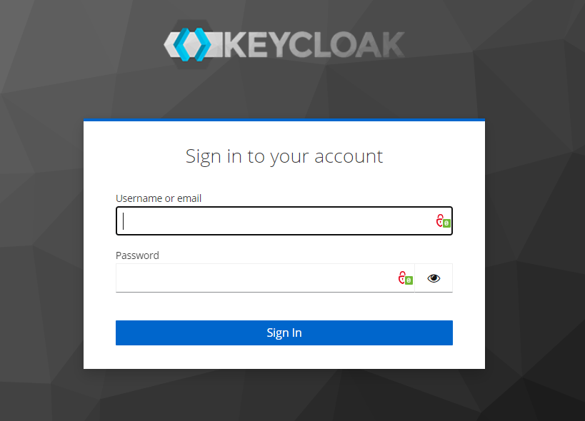
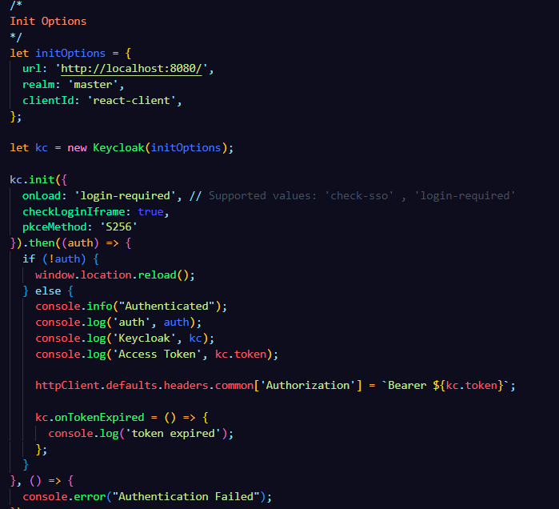
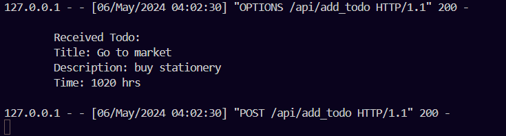
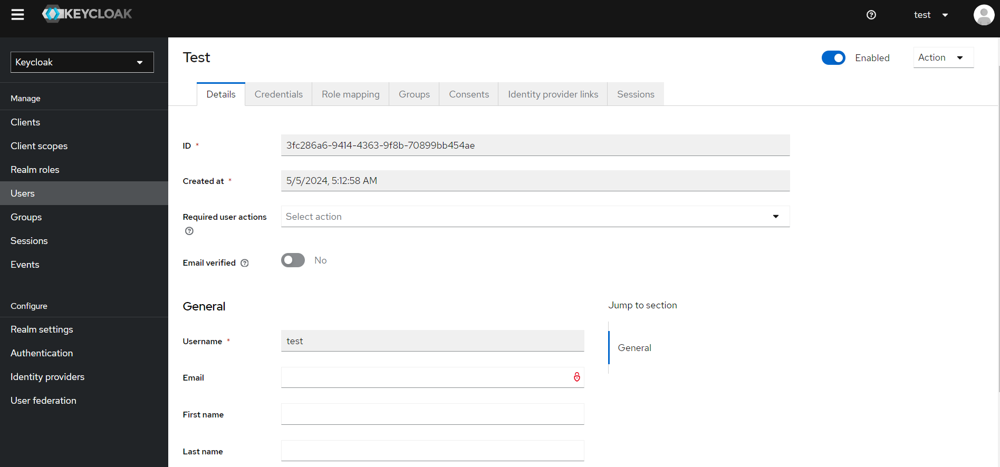

# ToDos-list-for-Dendrite-AI

authorization interface integrated using keycloak

keycloak configuration

This is the interface of the app

The data being sent to the server using Flask as the backend

Test user being created for Keycloak authorization

