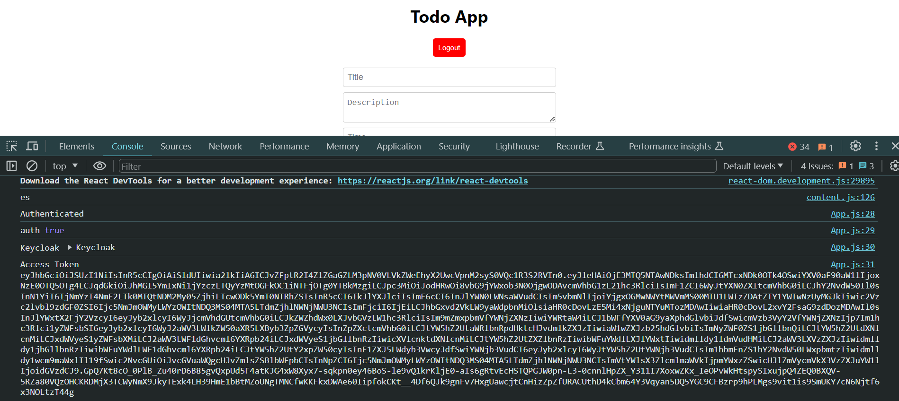

# ToDos-list-for-Dendrite-AI
1. 
authorization interface integrated using keycloak

2. 

keycloak configuration

3. 

Keycloak authorisation successfull

3. 
This is the interface of the app

4. 
The data being sent to the server using Flask as the backend

5. 
Test user being created for Keycloak authorization

